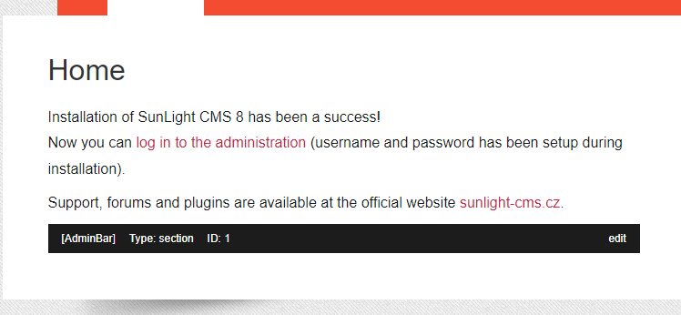

AdminBar
########

Adds a bar to pages/articles/topics with basic information about the page and useful links to make it easier to manage.

.. contents::

Requirements
************

- SunLight CMS 8

Installation
************

::

    Copy the folder 'plugins' and its contents to the root directory

or

::

    Installation via administration: 'Administration > Plugins > Upload new plugins'

Features
********

- displays the type and id of the page/article/topic
- adds a link for editing
- adds a link to the category to create a new article
- adds a link to manage images in the gallery

Preview
*******
